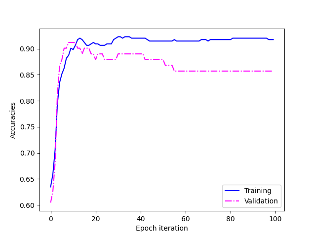
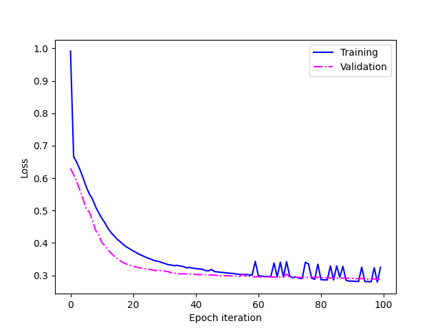

# Neural Network From Scratch 
## Description
This program construct a neural network that can be used with different options for binary classification.

## Prerequisites
- Python 3.6 or higher
- Required libraries: pandas, numpy, matplotlib, sklearn, scipy, seaborn, optuna

## Getting Started
1. Clone this repository to your local machine.
2. Place your dataset in a file named `data.csv`. And place it under the data folder. 

## Usage
### Training and Optimization
There are two modes to this program: 1. trial 2.model. If you already know the parameters of your NN architecture you can use option 2 directly but if you don't know the best parameters that should be used for your data set you can use trial mode. ensure you adjust the "Objective" method in the main.py to adjust the range of the parameters you want to study: 

    - Command for Trial mode: python main.py --mode trial: 
    - Command for Model mode: python main.py --mode model --layers <layers> --epochs <epochs> --learning_rate <learning_rate>

The result of the model performance, including loss curves, accuracy, and evaluation metrics, will be displayed in the terminal during training and the associated graphs are saved as .png file.

## Methodology
For this dataset, we conducted an initialize analysis before training. The analysis results can be found in the "DataAnalysis.pdf" document. The following steps outline our approach to building and training the neural network:

- Data Preprocessing:
  - The dataset is preprocessed, including data scaling, to ensure that it's suitable for training.

- Neural Network Architecture:
  - The neural network is implemented using the `NeuralNetwork` class provided in the code.
  - The architecture consists of an input layer, one or more hidden layers, and an output layer.
  - The number of neurons in each layer is defined by the `n_input`, `n_hlayers`, and `n_output` parameters.
  - The activation function used in the hidden layers is Rectified Linear Unit (ReLU), while the output layer uses the sigmoid activation function.

- Weight Initialization:
  - The network's weight matrices and bias vectors are using Xavier/Glorot initialization which is a common practice to address the vanishing/exploding gradient problem and helps neural networks converge more effectively, especially in deep architectures

- Regularization:
  - To prevent overfitting, both L1 and L2 regularization techniques are applied to the loss function. This helps in controlling the complexity of the neural network model.

- Training:
  - The network is trained using backpropagation through stochastic gradient descent (SGD).
  - During each training epoch, the network's weights and biases are updated based on the calculated gradients to minimize the loss function.
  - The training process includes both training and validation phases.

- Loss and Metrics:
  - The loss function is calculated to measure the model's performance. It includes cross-entropy loss with L1 and L2 regularization terms.
  - Evaluation metrics, including accuracy, precision, recall, and F1-score, are used to assess the model's performance.

